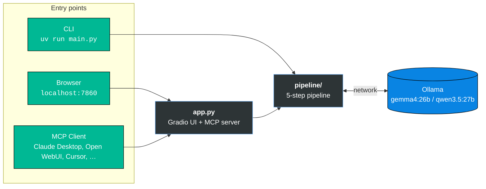
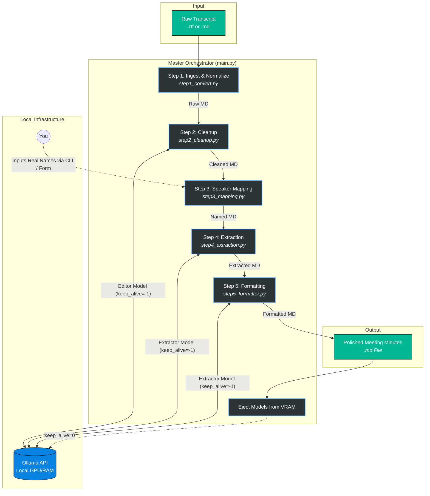
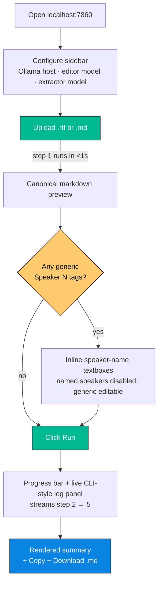

# Local Meeting Transcript Summarizer

> [!Note]
> A multi-agent, privacy-first pipeline that turns raw meeting transcripts into polished, corporate-grade meeting minutes using local LLMs (Gemma / Qwen) via Ollama. Accepts `.rtf` exports from [Moonshine.ai](https://note-taker.moonshine.ai/) **and** `.md` exports from our local transcriber — step 1 auto-detects the format and normalises both into the same canonical speaker-tagged markdown before the LLM agents run. Nothing leaves your network.

---

## Architecture at a glance

Three ways in, one pipeline, one Ollama connection:



`main.py` (CLI) is first-class and remains the canonical reference implementation. `app.py` is a **skin over `main.py`** — same pipeline modules, same Ollama contract — that adds a Gradio browser UI on one side and an MCP tool endpoint on the other. The full design spec lives in [`contexts/gradio_app.md`](contexts/gradio_app.md).

---

## Overview

Generating high-quality meeting minutes locally from 45+ minute transcripts is challenging. Passing a raw `.rtf` file with a single massive system prompt to a ~27B parameter local model often results in cognitive overload, hallucinated action items, and dropped details.

**Our Solution:** We break the problem down into a **5-step chained pipeline**. By isolating tasks — cleanup, human-in-the-loop speaker identification, data extraction, and final formatting — we can achieve "Google-level" summary quality using local, consumer-grade hardware while keeping sensitive corporate data 100% private.

---

## Key Learnings & Architecture Decisions

During the development of this pipeline, several critical discoveries shaped the architecture:

1. **RTF Noise vs. Markdown:** Raw RTF tags consume thousands of wasted tokens and confuse LLMs. Stripping the RTF into explicit Markdown (`**Speaker 1:** text`) acts as an anchor, helping the model perfectly distinguish between the speaker and the dialogue.
2. **The "Human-in-the-Loop" Necessity:** LLMs frequently hallucinate action-item ownership if speakers don't explicitly name themselves. A fast, non-LLM CLI prompt (or web form) to map generic tags (e.g., "Speaker 1") to real names (e.g., "Andro") eliminates this risk entirely. When the MCP tool is called by an agent with no human available, speakers can be supplied explicitly via a `speaker_map` argument — see [Web UI & Tool-Calling](#web-ui--tool-calling-gradio--mcp).
3. **Extraction vs. Formatting:** Asking an LLM to extract data *and* format it into tables simultaneously leads to data loss. We split this: Agent 2 acts as a "Data Harvester" (extracting exhaustive, categorized bullets), and Agent 3 acts as the "Publisher" (formatting the dense data into clean tables and lists).
4. **Model Nuances (Gemma vs. Qwen):**
   * **Gemma (~26B)** excels at natural language smoothing and narrative flow but needs strict structural guides.
   * **Qwen (~27B)** is highly logical but tends to over-compress. It requires "negative constraints" (e.g., *CRITICAL INSTRUCTION: DO NOT summarize away technical details*) to ensure high data fidelity.
   * *Solution:* The pipeline uses **Dynamic Prompting**, automatically switching the internal system prompt based on the `--model` argument passed in the CLI (or the `editor_model` / `extractor_model` selected in the web UI / MCP call).
5. **VRAM Optimization:** We utilize the `keep_alive=-1` parameter in the Ollama API to keep the LLM loaded in VRAM across the sequential scripts, drastically reducing execution time. Every entry point (CLI, web UI, MCP) also ejects models at the end of a run via `keep_alive=0`, so Ollama's VRAM is returned to the shared pool as soon as the pipeline finishes.

---

## Prerequisites

* **Python 3.12+**
* **[uv](https://github.com/astral-sh/uv)** (Python package manager)
  ```bash
  # after installing uv
  uv sync
  ```
* **Environment variables.** You MUST create a `.env` file (see [`.env.template`](.env.template)) in the project root containing your Ollama host address. The pipeline will not run without it.
* **[Ollama](https://ollama.com/)** running locally or on your network, reachable at whatever you set in `OLLAMA_HOST`.
* **Local models.** Pull your preferred models in Ollama:

  ```bash
  ollama pull gemma4:26b
  ollama pull qwen3.5:27b   # optional; only needed for the mix-and-match strategy
  ```

  > [!Warning]
  > As of April 2026, the internal system prompts are tailored to `gemma4:26b` and `qwen3.5:27b`. If using a different model or even same-family models with higher or lower weights, you may need to adjust the system prompts via experimentation or tweak the affordances of the respective agent scripts.

---

## Quickstart

Three entry points, one `uv sync` away:

### CLI (master orchestrator)

```bash
uv run main.py transcripts/MeetingTranscript.rtf
```

End-to-end: ingest → cleanup → prompts you in the terminal for speaker names → extract → format → ejects models from VRAM. Output lands in `output/final_summaries/`.

### Web UI (browser)

```bash
uv run app.py
```

Open <http://localhost:7860>. Upload a transcript, fill speaker names in the form that auto-appears, click **Run**. Copy or download the rendered summary. See [Web UI & Tool-Calling](#web-ui--tool-calling-gradio--mcp) for details.

### MCP tool (from another LLM)

`uv run app.py` also boots an MCP server at <http://localhost:7860/gradio_api/mcp/> (Streamable HTTP transport). Point Claude Desktop, Open WebUI, Cursor, the MCP Inspector, or any other MCP client at it and call the single exposed tool, `summarize_transcript`. See [MCP exposure](#mcp-exposure) for the contract and file-argument formats.

---

## Pipeline Architecture



### Step 1: Ingest & Normalize Transcript (Non-LLM)

Dispatches by file suffix:

- `.rtf` → strips Moonshine's RTF formatting and groups consecutive speech.
- `.md` → parses our local transcriber's H3-heading format (with per-turn timestamps and language tags), or passes through an already-canonical markdown file unchanged.

Both paths emit the same canonical Markdown (`**Speaker N:** text`) plus a JSON sidecar with turn stats. See [`contexts/multi_format_ingest.md`](contexts/multi_format_ingest.md) for the full spec and design decisions.

```bash
# Moonshine input (.rtf)
uv run python -m pipeline.step1_convert transcripts/<MeetingTranscript>.rtf --out-dir output/raw_files/

# Our local transcriber's input (.md)
uv run python -m pipeline.step1_convert transcripts/<MeetingTranscript>.md --out-dir output/raw_files/
```

### Step 2: Agent 1 — Transcript Cleanup

The LLM acts as a **Data Cleaner**. It proofreads the raw markdown, removes verbal stutters, false starts, and filler words without summarizing or losing chronological context.

```bash
uv run python -m pipeline.step2_cleanup output/raw_files/<MeetingTranscript>.md --out-dir output/cleaned_files/
```

### Step 3: Speaker Mapping (Human-in-the-Loop)

A quick non-LLM script that scans for `Speaker X:` tags and pauses to ask you for their real names. It then performs a global find-and-replace, ensuring 100% accurate attribution for the subsequent AI steps.

```bash
uv run python -m pipeline.step3_mapping output/cleaned_files/<MeetingTranscript>_cleaned.md --out-dir output/named_files/
```

Internally this step exposes two pure primitives — `detect_generic_speakers(content)` and `apply_speaker_mapping(content, mapping)` — that the web UI and MCP tool reuse directly. The CLI `map_speakers()` wrapper around them is what asks at the terminal.

### Step 4: Agent 2 — Information Extraction

The LLM acts as a **Data Harvester**. It scans the named transcript and extracts exhaustive, high-fidelity bullet points, organizing them into logical H3 sub-categories while preserving specific metrics, dates, and brands.

```bash
uv run python -m pipeline.step4_extraction output/named_files/<MeetingTranscript>_named.md --out-dir output/extracted_files/
```

### Step 5: Agent 3 — Final Formatting

The LLM acts as the **Publisher**. It takes the dense extraction and formats it into a professional layout, generating a "Participants" list and organizing Action Items into a strict Markdown table `(Task | Owner | Status)`.

```bash
uv run python -m pipeline.step5_formatter output/extracted_files/<MeetingTranscript>_extracted.md --out-dir output/final_summaries/
```

---

## Advanced CLI Usage

All AI agents (steps 2, 4, 5) support CLI overrides for the model and the host URL. The scripts will automatically detect if you are using a Gemma or Qwen model and apply the optimized system prompt.

> [!Warning]
> As of April 2026, the internal system prompts are tailored to `gemma4:26b` and `qwen3.5:27b`. If using a different model or even same-family models with higher or lower weights, you may need to adjust the system prompts via experimentation or tweak the affordances of the respective agent scripts.

### The Master Orchestrator (main.py)

Because every step in this pipeline is modular, you do not need to run the individual scripts one by one. The master orchestrator runs the entire pipeline end-to-end: it builds the output directories, processes the transcript, pauses to ask you for speaker names, and generates the final summary.

```bash
# Full pipeline with default models (on a Moonshine RTF)
uv run main.py transcripts/MeetingTranscript.rtf

# Or on our local transcriber's markdown export
uv run main.py transcripts/MeetingTranscript.md

# Full pipeline using the mix-and-match model strategy
uv run main.py transcripts/MeetingTranscript.rtf \
    --editor-model gemma4:26b \
    --extractor-model qwen3.5:27b
```

### Mixing and Matching Models (the "best of both worlds" strategy)

Because different LLMs excel at different cognitive tasks, you are not locked into a single model for the entire pipeline.

For example, Gemma models are historically fantastic at natural language smoothing and narrative flow, making them ideal for cleanup and formatting. Qwen models are highly logical and obedient to structural constraints, making them perfect for exhaustive data extraction.

You can leverage this by switching the `--model` argument at each step:

```bash
# Step 2: Gemma for natural, grammatical text cleanup
uv run python -m pipeline.step2_cleanup output/raw_files/Meeting.md \
    --out-dir output/cleaned_files/ \
    --model gemma4:26b

# Step 4: Qwen for rigid, exhaustive data extraction
uv run python -m pipeline.step4_extraction output/named_files/Meeting_named.md \
    --out-dir output/extracted_files/ \
    --model qwen3.5:27b

# Step 5: Back to Gemma for polished, corporate document formatting
uv run python -m pipeline.step5_formatter output/extracted_files/Meeting_extracted.md \
    --out-dir output/final_summaries/ \
    --model gemma4:26b
```

### Customizing the Ollama Host

If you are running Ollama on a dedicated home server, a secondary GPU rig, or within a specific Docker network, you can override the default URL (from your `.env`) using the `--host` flag:

```bash
uv run python -m pipeline.step2_cleanup input.md --host http://<your_ollama_host_ADDR>:<your_ollama_host_PORT>
```

`main.py` accepts the same `--host` flag and propagates it to every LLM-using step.

---

## Web UI & Tool-Calling (Gradio + MCP)

`app.py` is a Gradio front-end that wraps the exact same pipeline modules as `main.py` and also exposes the whole thing as a single MCP tool. One process, two audiences: humans via a browser, agents via an MCP client.

### Launching

```bash
uv run app.py
```

You'll see two URLs in the terminal:

```
* Running on local URL:       http://0.0.0.0:7860
* Streamable HTTP URL:        http://localhost:7860/gradio_api/mcp/
```

The first is the browser UI. The second is the MCP endpoint (Streamable HTTP transport, added in Gradio 6.13+).

> [!Note]
> `SERVER_HOST` defaults to `0.0.0.0`, so anyone on your LAN who can reach your machine on port 7860 can use both the web UI and the MCP endpoint. This is intentional — it's what makes cross-machine MCP tool calling work (see [Cross-machine topology](#cross-machine-topology)). Firewall the port off at the host level if that's not what you want.

### Web UI flow



**Sidebar (left, always visible):**
- **Ollama host** — prefilled from `OLLAMA_HOST` in your `.env`. Refresh button next to it re-tests reachability; an LED dot shows green (connected) / red (unreachable) / grey (no host set).
- **Editor model** / **Extractor model** — free-text. Shows ✓ available or ✗ not pulled based on the host's `/api/tags`.

**Main column:**
1. **Upload** (drag-drop or file picker) — `.rtf` or `.md`, 10 MB cap.
2. **Preview** of the normalized canonical markdown, plus a one-line summary (turn count, speaker detection).
3. **Speaker names form** — appears automatically whenever step 1 found any speakers at all. Generic `Speaker N` tags get editable textboxes; already-named speakers get disabled "(already named)" textboxes so you can see the full cast. Leave a generic field blank to keep the original tag.
4. **Run** (and **Stop** mid-run, which cancels the generator; Ollama's current step finishes before models unload — documented trade-off of the non-streaming Ollama call, see [`contexts/gradio_app.md` — decision F3](contexts/gradio_app.md)).
5. **Console** with a progress bar and a live streaming log panel. The log panel captures the exact same stdout the CLI prints.
6. **Final summary** rendered inline, with **Rendered** / **Raw** toggle, **Copy** (puts markdown source on the clipboard), and **Download .md**.

Session state (uploaded file, tempdir, models the session touched) is scoped to one browser session. Closing the tab triggers cleanup (Gradio's ~1-hour GC window actually performs it); SIGTERM and `atexit` handlers eject any still-loaded models on process shutdown.

### MCP exposure

Launching with `uv run app.py` also boots an MCP server at `/gradio_api/mcp/` that exposes **exactly one** tool:

```text
summarize_transcript(
    file: str,
    editor_model: str = "gemma4:26b",
    extractor_model: str = "gemma4:26b",
    ollama_host: str | None = None,
    speaker_map: dict[str, str] | None = None,
) -> str
```

Returns the final meeting-minutes markdown as a plain string. Raises `ValueError` for bad config / unreachable Ollama / unknown format, and `RuntimeError` for mid-pipeline failures. In all cases the models loaded during the call are unloaded and the per-call tempdir is removed before the exception propagates.

> [!Warning]
> **Speaker-map quality matters for MCP calls.** There is no human in the loop, so step 3 (speaker mapping) is effectively a no-op unless you pass a `speaker_map`. Generic `Speaker N` tags left untranslated can lead to mis-attributed action items. For best results, either pre-name speakers in the transcript source, or pass `speaker_map={"Speaker 1": "Alice", "Speaker 2": "Bob"}` along with the `file` argument.

#### The `file` argument — three formats

MCP clients don't always share a filesystem with the server, so `file` accepts three different string formats and picks the right path internally:

| Prefix | Meaning | Example |
| :--- | :--- | :--- |
| `data:<mime>;base64,<payload>` | Inline base64 of the file contents. `.rtf` if mime contains `rtf`, else `.md`. Fine for small transcripts. | `data:text/markdown;base64,IyMgTWVl…` |
| `http://...` or `https://...` | Public URL the server can fetch via `httpx`. Best for cross-machine calls. | `http://192.168.30.119:8000/yt_video_en.md` |
| anything else | Absolute path on the **server's** filesystem (NOT the MCP client's). Must exist. | `/home/user/transcripts/meeting.rtf` |

Unknown prefixes and missing files produce a clear `ValueError` quoting the received value — typos like `file: http://...` (the literal label text leaking into the value) surface immediately rather than silently misclassifying.

#### Cross-machine topology

The most useful deployment puts the Gradio server on a GPU host (e.g. ziggie, our dual-5090 workstation) and keeps the MCP client on your laptop. A quick one-line file server on your laptop makes transcripts visible to ziggie over HTTP:

```mermaid
graph TB
    subgraph "Your laptop"
        CLIENT[MCP Client<br/>Claude Desktop / Inspector]
        FILE[(Transcript<br/>on disk)]
        HTTP["python3 -m http.server 8000"]
        FILE -. serves .-> HTTP
    end

    subgraph "Gradio host (e.g. ziggie)"
        APP["app.py<br/>:7860/gradio_api/mcp/"]
        PIPE["pipeline/"]
        APP --> PIPE
    end

    subgraph "Ollama host (same or separate)"
        OLL[("Ollama :11434")]
    end

    CLIENT ==>|"summarize_transcript(<br/>file='http://laptop:8000/meeting.md'<br/>)"| APP
    APP -. httpx.stream .-> HTTP
    PIPE <==>|LLM calls| OLL
    APP ==>|"returns final markdown"| CLIENT

    classDef client fill:#00b894,stroke:#000,color:#fff;
    classDef server fill:#2d3436,stroke:#74b9ff,color:#fff;
    classDef infra fill:#0984e3,stroke:#000,color:#fff;
    class CLIENT,FILE,HTTP client;
    class APP,PIPE server;
    class OLL infra;
```

Minimal Mac-laptop setup to test this:

```bash
# on your laptop, in the transcripts/ directory:
python3 -m http.server 8000

# find your LAN IP:
ifconfig en0 | awk '/inet /{print $2}'

# then in your MCP client, call summarize_transcript with:
#   file = http://<your-laptop-lan-ip>:8000/<transcript-filename>
#   ollama_host = http://<ollama-host-ip>:11434   (e.g. ziggie)
```

> [!Tip]
> **MCP client timeouts.** `summarize_transcript` is not a generator — it runs the full 3–5 minute pipeline and returns once. MCP clients with short default timeouts will error out mid-wait even though the server completes successfully. For the MCP Inspector, bump `Request Timeout` to `600000` and `Maximum Total Timeout` to `900000` (both in ms) under the **Configuration** panel in the left sidebar. Other clients (`mcpo`, Open WebUI) will need similar adjustments.

---

## Directory Structure

```txt
.
├── README.md
├── LICENSE
├── .env.template
├── pyproject.toml
├── uv.lock
├── main.py                       # CLI orchestrator
├── app.py                        # Gradio + MCP server
├── pipeline/
│   ├── __init__.py               # announce() helper shared by main.py and app.py
│   ├── step1_convert.py
│   ├── step2_cleanup.py
│   ├── step3_mapping.py          # exports detect_generic_speakers + apply_speaker_mapping
│   ├── step4_extraction.py
│   └── step5_formatter.py
├── assets/
│   └── refresh.svg               # web UI refresh icon (FontAwesome)
├── contexts/
│   ├── gradio_app.md             # spec + milestone log for the Gradio/MCP work
│   └── multi_format_ingest.md    # spec for step 1's RTF+MD dispatcher
├── transcripts/                  # sample inputs (gitignored by default)
└── output/                       # CLI outputs — one dir per pipeline step
    ├── raw_files/
    ├── cleaned_files/
    ├── named_files/
    ├── extracted_files/
    └── final_summaries/
```

The web UI and MCP tool never write to `output/`; they use a per-call `tempfile.mkdtemp()` that's cleaned up when the session / call ends. Only `main.py` writes to the on-disk `output/` tree.

---

## Design notes

The trickier decisions and their *why*, condensed from [`contexts/gradio_app.md`](contexts/gradio_app.md):

### 10 MB upload cap, no token-budget pre-check

Speech is ~150 words/min. A 3-hour meeting is ≈ 27k words ≈ 180 KB of plain text; Moonshine's RTF overhead puts it around 1 MB. Anything larger than a couple of MB is almost certainly a copy-paste mistake, a RTF with embedded images, or an archive renamed to `.rtf`. 10 MB is a permissive backstop that catches accidents without getting in any realistic user's way.

The *real* constraint is the LLM context window — Gemma/Qwen 27B at ~32k tokens ≈ 24k words ≈ ~2.5 hours of speech. Longer than that and Ollama will silently truncate or error. A proper token-budget pre-flight check is the right fix, but it requires model-specific tokenizer awareness and isn't worth building before the UI ships. For now: educate the user via a soft tip near the upload component, let them hit the wall if they exceed the model's window.

### One monolithic MCP tool

Gradio would happily expose every event handler as an MCP tool when `mcp_server=True`, including `test_ollama_connection`, `validate_model_available`, the form-change handlers, etc. From an agent's point of view that's a pile of UI plumbing tools that don't make sense outside a browser context. The cleanest surface is **one** tool with a complete input signature: file, models, optional host override, optional pre-filled speaker map. Agents don't need a multi-step UI dance. Every UI-side event listener is marked `api_visibility="private"` to keep it off the MCP schema.

### Tempdir instead of in-memory

`pipeline/step*.py` modules were built to pass `Path` objects between steps, because the CLI is the first-class interface and on-disk artifacts are useful for debugging. Refactoring all of them to pass strings in memory would have been invasive and would have risked breaking the CLI. Using a per-session / per-call `tempfile.mkdtemp()` as `out_dir` gives us "no persistent server writes" without any refactoring cost — the pipeline's own `out_dir` parameter is all we need.

### Serialized queue, one pipeline at a time

Ollama runs one model at a time on a GPU effectively. Concurrent pipelines would cause constant VRAM thrash, unloading and reloading 26B-parameter models on every turn. Gradio's default queue serializes jobs, which gives us predictable behaviour with zero effort. If you open two browser tabs, each gets its own session; tab B simply waits for tab A's run to finish.

### No structured logging

Container stdout captures enough for basic debugging. Per-session correlation IDs are nice but add build/test surface for marginal value. If we later deploy at scale and need proper observability, that's a separate project.

### MCP auto-skips step 3 (human-in-the-loop)

There's no human to prompt when an LLM is the caller. The alternatives are (a) error out when generic tags exist — hostile to agents, (b) hallucinate names — bad output, or (c) pass through with generic labels — imperfect but honest. We chose (c) and warned about it prominently in the tool description, so the calling agent can surface the caveat to its user. Callers who want accurate attribution can either pre-name speakers in the transcript source or pass `speaker_map` directly.

### Cancellation and non-streaming Ollama (trade-off)

The Web UI's **Stop** button cancels the generator immediately — but because each pipeline step is a single non-streaming HTTP call to Ollama (not token-by-token), the in-flight Ollama request keeps running in a daemon thread until it finishes on its own. Models unload in the `finally` block, which means a "cancel mid-run" can take 1–3 minutes to actually free VRAM on a big model. Documented trade-off; we can upgrade to streaming later if the UX ever feels bad.

### Process-shutdown hooks

Every `(host, model)` pair ever loaded during the process's lifetime is tracked in a module-level set. An `atexit` handler walks it on normal Python exit (covers Ctrl-C, since SIGINT → KeyboardInterrupt → atexit). A `SIGTERM` handler does the same for `docker stop` and kill-term. This is not bulletproof against `kill -9`, but it's clean enough for rolling deploys on ziggie.

---

## License

[MIT](LICENSE)

---

## ToDo

- [x] Core business-logic extensions — multi-format ingest support
  - [x] Auto-detect `.rtf` vs `.md` at step 1; skip RTF conversion when input is already markdown.
  - [x] Transcriber's H3-heading diarization pattern normalized into the same canonical `**Speaker N:**` shape as Moonshine.
  - [x] Speaker IDs and real names both parsed; if the transcriber has already renamed speakers, step 3's human-in-the-loop pass becomes a no-op automatically.
- [x] Gradio implementation (chosen for its built-in API and MCP support).
- [x] Gradio with simple API and MCP (local testing — Tests 1–3).
- [x] Test MCP with remote / cross-machine file transfer (Test 4: Gradio on ziggie, MCP Inspector on Mac, transcript hosted from Mac via `python -m http.server`, pipeline ran on ziggie's GPUs, summary returned across the LAN).
- [ ] Test with tool-calling features from Open WebUI (via `mcpo` bridge).
- [ ] Deploy in Docker.

---

<sub>Saurabh Datta · [zigzag.is](https://zigzag.is) · Berlin · April 2026</sub>
